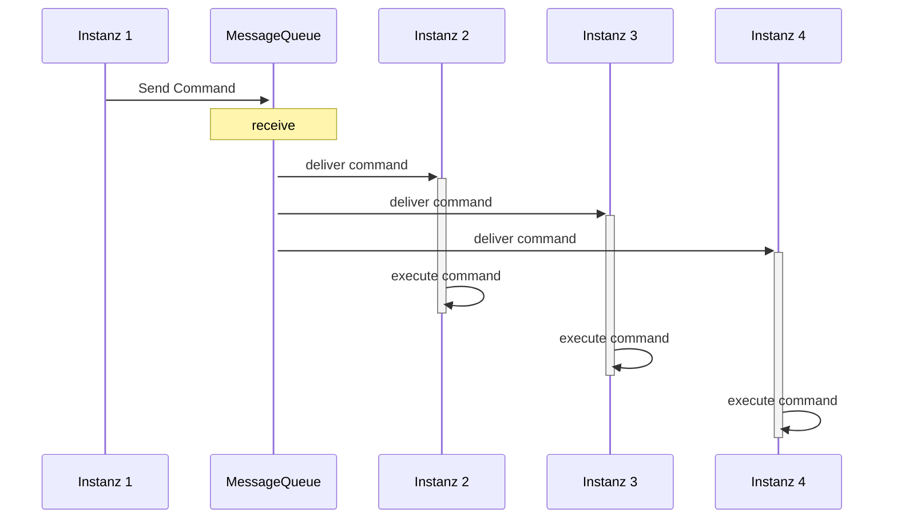

# Application Topic Pattern

## Introduction

In modern distributed systems, maintaining consistent state across various instances of an application is a critical challenge. The AppTopic Pattern addresses this issue by leveraging a message queue API to ensure reliable and consistent communication and state synchronization within a Kubernetes cluster.

This pattern is designed to integrate seamlessly into any application requiring high availability and consistency across multiple instances running in a cloud-native environment. It uses a publish-subscribe model, where different services within the application can publish or subscribe to specific topics. These topics facilitate the propagation of state changes or important events across all instances of the application, ensuring that each part of the system remains up-to-date with the latest data.



## Implementation

To implement this feature, look at the following example:

```json
// appsettings.config
{
    "MessageQueue": {
        "ConnectionString": "http://localhost:9091",
        "Namespace": "production"
    }
}
```

Register at least this MessageQueueNet Services:

```csharp
builder.services
    .AddMessageQueueClientService()
    .AddMessageQueueAppTopicServices(config =>
    {
        config.MessageQueueApiUrl = configuration["MessageQueue:ConnectionString"] ?? "";
        // optional
        config.MessageQueueClientId = configuration["MessageQueue:ClientId"] ?? "";
        config.MessageQueueClientSecret = configuration["MessageQueue:ClientSecret"] ?? "";
        config.MaxPollingSeconds = 20;  // Maximal polling time, for query new items.
                                        // After this time, the Requests end and
                                        // a new request will be opend

        config.AppName = "my-app-name";
        // optional: but use it, to show, wich instances should be syncronized.
        // it is important, if developement, test, staging, production instances use the
        // same massagequeue to syncronize
        config.Namespace = configuration["MessageQueue:Namespace"] ?? "";

        config.QueueLifetimeSeconds = 120;     // optional
        config.ItemLifetimeSeconds = 120;      // optional
        config.ManageQueueLiftimeCycle = true;  // true ... default
    })
    .AddMessageHandler<ClearInMemoryCacheMessageQueueHandler>()
    .AddMessageHandler<...MessageQueueHandler>()
    .AddMessageHandler<...MessageQueueHandler>();
```

this will create a queue on startup with the following name:

```
production.my-app-nameBD98A4C2-5F38-4FF8-9C5C-4318D7A9AE3E   // {Namespace}.{AppName}{auto-genereted-guid}
```

If you run several instances of your app, every instance gets a individual queue, only differs by the GUID

Create a class that implements `IMessageHandler` to handle actions for an app instance.
This must be registred with `builder.services.AddMessageHandler()` (see above).

```csharp
[MessageHandler(CommandName = CommandName)]  // optional. if not set, the command Name will be the name of the class. Use olny letters and numbers here
internal class ClearInMemoryCacheMessageQueueHandler : IMessageHandler
{
    public const string CommandName = "ClearInMemCache";

    private readonly IMyCache _myCache;
    private readonly ILogger<ClearInMemoryCacheMessageQueueHandler> _logger;

    public MessageQueueNetMessageHandler(
                IMyCache myCache,
                ILogger<ClearInMemoryCacheMessageQueueHandler> logger)
    {
        _myCache = myCache;
        _logger = logger;
    }

    async public Task InvokeAsync(string message)
    {
        try
        {
            _myCache.Clear();
        }
        catch (Exception ex)
        {
            _logger.LogWarning("Exception: {exceptionMessage}", ex.Message);
        }
    }
}
```

A `BackgroundWorker` (registered above with `builder.services.AddMessageQueueAppTopicServices()`) waits for new messages, that must fit the following pattern:

```
{command/handler-name}:{message}
```

If a suitable `IMessageHandler` is registered its `InvoceAsync(string message)` method will be called.

To send a message to all instances of your application use the `MessageQueueAppTopicService`.
(This shoud be registered above with `builder.services.AddMessageQueueAppTopicServices(...)`).

```csharp
class MyServiceOrController(MessageQueueAppTopicService topicService)
{
    public void ClearAllCaches()
    {
        bool includeOwnQueue = true; // send the messages also to the queue of the current instance

        topicService.EnqueueAsync<ClearInMemoryCacheMessageQueueHandler>(
                    ["Hi there, please clear cache ;)"],
                    includeOwnQueue
                );
    }
}
```

This sends a message to all queues fitting the following pattern:

```
production.my-app-name*   // {Namespace}.{AppName}*
```

[Processor Pattern](./processor_pattern_en.md)
