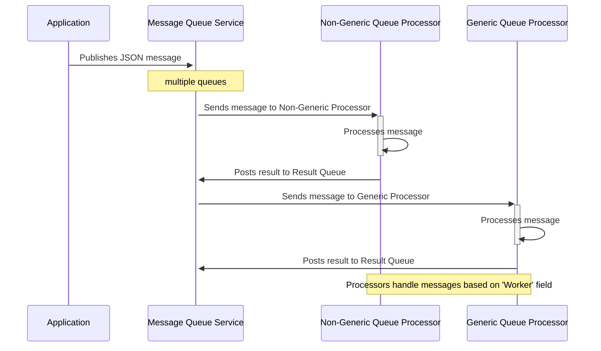

# Processor Pattern

## Introduction

The Processor Pattern is designed to enhance the processing capabilities of applications by monitoring multiple queues within a message queue system. This pattern focuses on the efficient handling and processing of messages serialized in JSON format, facilitating robust and scalable application architectures.



## Core Concept

At the heart of the Processor Pattern is the BaseQueueProcessorMessage class, which includes essential information such as `ProcessId`, `Worker`, and optional fields for `ResultQueue`, `Publisher`, and `Subject`. This class serves as the standard message format that is enqueued and processed by various workers.

```csharp
public class BaseQueueProcessorMessage
{
    public string ProcessId { get; set; } = "";
    public string Worker { get; set; } = "";
    public string? ResultQueue { get; set; }
    public string? Publisher { get; set; }
    public string? Subject { get; set; }
}
```

## Processing Mechanism

Messages are consumed by specific workers defined by either `INonGenericQueueProcessor` or `IGenericQueueProcessor<T>` interfaces. Each worker is associated with a unique `WorkerId` and has a policy defined by ConfirmAlways indicating whether to always acknowledge message processing after finishing.

**Non-Generic Processor:**

```csharp
public interface INonGenericQueueProcessor : IQueueProcessor
{
    Task<QueueProcessorResult> Process(BaseQueueProcessorMessage jobProcessMessage, CancellationToken cancellationToken);
}
```

**Generic Processor:**:

```csharp
public interface IGenericQueueProcessor<T> : IQueueProcessor where T : new()
{
    Task<QueueProcessorResult> ProcessGeneric(GenericQueueProcessorMessage<T> message, CancellationToken cancellationToken);
}

```

When a message is received, it is delegated to an appropriate processor based on the message’s `Worker` field. The processor executes the `Process()` or `ProcessGeneric()` method depending on its type. Once the processing is complete, the result is optionally published back to a _Result Message Queue_ if specified, facilitating further asynchronous communication or result handling.

## Benefits of the Processor Pattern

-   Flexibility: Handles both generic and non-generic message processing, allowing for versatile application scenarios.
-   Scalability: Efficiently processes a large volume of messages by distributing tasks across multiple workers.
-   Resilience: Enhances fault tolerance through isolated processing and optional acknowledgments.

This pattern is particularly useful in environments where high throughput and reliability are required, such as real-time data processing systems and large-scale enterprise applications. The following sections will guide you through setting up and integrating the Processor Pattern into your system, ensuring that you can leverage its full potential for advanced message handling and processing.

## Implementation

```csharp
builder.services
    .AddCommandLineWorker(
        commandLineWorkerOptions =>
        {
            commandLineWorkerOptions.CommandFilters = ["mycmd.bat"];  // only this
        },
        fileOutputOptions =>
        {
            fileOutputOptions.RootPath = @"C:\temp\processor";
        })
    .AddMessageQueueClientService()
    .AddQueueProcessorWatcher(
        config =>
        {
            config.MessageQueueApiUrl = "http://localhost:9091";
            config.QueueNameFilter = "processor.*";  // all queues with this pattern ar watched
        });

```

Here the _Commandline Worker_ (included in the solution is registered).
Look at the implementation how to build your own implemenations of `IQueueProcessor`.

A command line tool, that implements this, is introduced in the next section.

[Commandline Tools](../console/tools_en.md)
