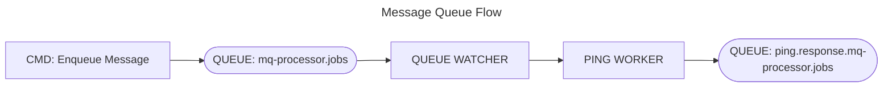

# Queue Worker

``` csharp
builder.services.AddQueueWatcher(
    config =>
    {
        config.MessageQueueApiUrl = "https://localhost:5001";// url to the messagequeue service;
        config.QueueNameFilter = "mq-processor.jobs";        // filter: this queues will be watched
                                                             // single queue: "my-queue",  
                                                             // queue filter: "my-queues.*" or 
                                                             // serveral queue filters: "my-queues.*,our-queues.*"  
    });
```

``` csharp
public interface IQueueProcessor
{
    string WorkerId { get; }

    bool ConfirmAlways { get; }
}
```

``` csharp
namespace MessageQueueNET.Client.Services;
internal class PingWorker : INonGenericQueueProcessor
{
    public const string WorkerIdentifier = "mq.ping";

    public string WorkerId => WorkerIdentifier;

    public bool ConfirmAlways => true;

    public Task<QueueProcessorResult> Process(
        BaseQueueProcessorMessage jobProcessMessage, 
        CancellationToken cancellationToken)
    {
        if (jobProcessMessage?.ResultQueue is not null 
            && jobProcessMessage.ResultQueue.StartsWith("ping.response.") == false)
        {
            jobProcessMessage.ResultQueue = $"ping.response.{jobProcessMessage.ResultQueue}";
        }

        return Task.FromResult(new QueueProcessorResult());
    }
}
```

```
.\MessageQueueNET.Cmd.exe https://localhost:5001 -c shell

>> mq-processor.jobs enqueue -ping -m 1
```



