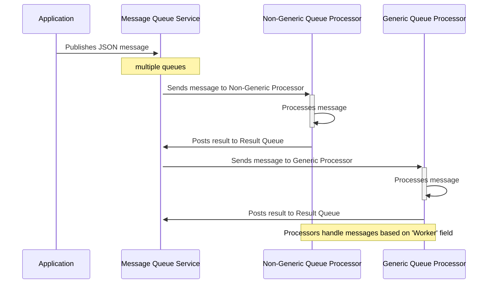

# Queue Worker Pattern

## Introduction

The Queue worker Pattern is designed to enhance the processing capabilities of applications by monitoring multiple queues within a message queue system. This pattern focuses on the efficient handling and processing of messages serialized in JSON format, facilitating robust and scalable application architectures.



## Core Concept

At the heart of the Processor Pattern is the BaseQueueProcessorMessage class, which includes essential information such as `ProcessId`, `Worker`, and optional fields for `ResultQueue`, `Publisher`, and `Subject`. This class serves as the standard message format that is enqueued and processed by various workers.

```csharp
public class BaseQueueProcessorMessage
{
    public string ProcessId { get; set; } = "";
    public string Worker { get; set; } = "";
    public string? ResultQueue { get; set; }
    public string? Publisher { get; set; }
    public string? Subject { get; set; }
}
```

## Processing Mechanism

Messages are consumed by specific workers defined by either `INonGenericQueueProcessor` or `IGenericQueueProcessor<T>` interfaces. Each worker is associated with a unique `WorkerId` and has a policy defined by ConfirmAlways indicating whether to always acknowledge message processing after finishing.

**Non-Generic Processor:**

```csharp
public interface INonGenericQueueProcessor : IQueueProcessor
{
    Task<QueueProcessorResult> Process(BaseQueueProcessorMessage jobProcessMessage, CancellationToken cancellationToken);
}
```

**Generic Processor:**:

```csharp
public interface IGenericQueueProcessor<T> : IQueueProcessor where T : new()
{
    Task<QueueProcessorResult> ProcessGeneric(GenericQueueProcessorMessage<T> message, CancellationToken cancellationToken);
}

```

When a message is received, it is delegated to an appropriate processor based on the message’s `Worker` field. The processor executes the `Process()` or `ProcessGeneric()` method depending on its type. Once the processing is complete, the result is optionally published back to a _Result Message Queue_ if specified, facilitating further asynchronous communication or result handling.

## Benefits of the Processor Pattern

-   Flexibility: Handles both generic and non-generic message processing, allowing for versatile application scenarios.
-   Scalability: Efficiently processes a large volume of messages by distributing tasks across multiple workers.
-   Resilience: Enhances fault tolerance through isolated processing and optional acknowledgments.

This pattern is particularly useful in environments where high throughput and reliability are required, such as real-time data processing systems and large-scale enterprise applications. The following sections will guide you through setting up and integrating the Processor Pattern into your system, ensuring that you can leverage its full potential for advanced message handling and processing.

## Implementation

Add a queue watcher to your application

```csharp
builder.services
    .AddMessageQueueClientService()
    .AddQueueProcessorWatcher(
    config =>
    {
        config.MessageQueueApiUrl = "https://localhost:5001";// url to the messagequeue service;
        config.QueueNameFilter = "mq-processor.jobs";        // filter: this queues will be watched
                                                             // single queue: "my-queue",
                                                             // queue filter: "my-queues.*" or
                                                             // serveral queue filters: "my-queues.*,our-queues.*"
    });
```

if a message received, die watcher sends the message to a registered
worker. Message must contain the `WorkerId`

```csharp
public interface IQueueProcessor
{
    string WorkerId { get; }

    bool ConfirmAlways { get; }
}
```

The `PingWorker` is an automatically added for testing with `AddQueueProcessorWatcher`

```csharp
namespace MessageQueueNET.Client.Services;

internal class PingWorker : INonGenericQueueProcessor
{
    public const string WorkerIdentifier = "mq.ping";

    public string WorkerId => WorkerIdentifier;

    public bool ConfirmAlways => true;

    public Task<QueueProcessorResult> Process(
        BaseQueueProcessorMessage jobProcessMessage,
        CancellationToken cancellationToken)
    {
        if (jobProcessMessage?.ResultQueue is not null
            && jobProcessMessage.ResultQueue.StartsWith("ping.response.") == false)
        {
            jobProcessMessage.ResultQueue = $"ping.response.{jobProcessMessage.ResultQueue}";
        }

        return Task.FromResult(new QueueProcessorResult());
    }
}
```

To test you can use the `MessageQueueNET.Cmd.exe` console application:

```
.\MessageQueueNET.Cmd.exe https://localhost:5001 -c shell

>> mq-processor.jobs enqueue -ping -m 1
```


## Custom Workers

```csharp
namespace MessageQueueNET.Core.Services.Abstraction;

public interface IGenericQueueProcessor<T> : IQueueProcessor
    where T : new()
{
    Task<QueueProcessorResult> ProcessGeneric(
            GenericQueueProcessorMessage<T> message,
            CancellationToken cancellationToken
        );
}
```

T => an individual (Body) model that will be received to the Worker, eg:

```csharp
public class CommandLineWorkerMessage
{
    public string Command { get; set; } = "";
    public string Arguments { get; set; } = "";
}

public class CommandLineWorkerResultBody
{
    public int ExitCode { get; set; }
    public string? Output { get; set; }
    public string? ErrorOutput { get; set; }
}
```

```csharp
public class CommandLineWorker : IGenericQueueProcessor<CommandLineWorkerMessage>
{
    public const string WorkerIdentifier = "mq.commandline";

    public CommandLineWorker()
    {
        // Dependencies
    }

    public string WorkerId => WorkerIdentifier;

    public bool ConfirmAlways => true;

    async public Task<QueueProcessorResult> ProcessGeneric(
            GenericQueueProcessorMessage<CommandLineWorkerMessage>
            message, CancellationToken cancellationToken
        )
    {
        ProcessContext? proccessContext = null;

        try
        {
            // Business logic

            // Return a messages for next worker in the queue => eg. log results (CommandLineResultFileOutputWorker)
            // Message will be written to queue CommandLineResultFileOutputWorker.WorkerIdentifier
            return new GenericQueueProcessorResult<CommandLineWorkerResultBody>()
            {
                Worker = "mq-commandline.result.file",
                Body = new CommandLineWorkerResultBody()
                {
                    Output = ...
                    ErrorOutput = ...,
                    ExitCode = ...
                }
            };
        }
        catch (Exception ex)
        {
            return new QueueProcessorResult()
            {
                Succeeded = false,
                ErrorMessages = ex.ToString()
            };
        }
    }
}

```

Add custom Worker to Dependency Injection:

```csharp
builder.services..AddTransient<IQueueProcessor, CommandLineWorker>();
```

# Sending a Worker Message

Use the Client:

```csharp
var message = new BaseQueueProcessorMessage()
{
    ProcessId = "any id",
    Worker = "mq.ping",  // the WorkerId
    ResultQueue = $"ping.response.{cmdArguments.QueueName}",  // optional => response is written to this queue, for the next worker
    Subject = "ping", // optional
    Publisher = Environment.UserName,  // optional
};

if (!(await client.EnqueueAsync(new string[]
    {
        JsonSerializer.Serialize(message)
    })).Success)
{
    throw new Exception($"Can't enqueue messages...");
}
```

With an custom message body:

```csharp
var message = new GenericQueueProcessorMessage<CommandLineWorkerMessage>()
{
    ProcessId = ... // any id,
    Worker = CommandLineWorker.WorkerIdentifier,
    ResultQueue = $"{cmdArguments.QueueName}.results",
    Subject = ... // optional, eg the command name,
    Publisher = Environment.UserName,
    Body = new()
    {
        Command = cmdArguments.WorkerCommand,
        Arguments = "...." // arguments for the command
    }
};

if (!(await client.EnqueueAsync(new string[]
    {
        JsonSerializer.Serialize(message)
    })).Success)
{
    throw new Exception($"Can't enqueue messages...");
}
```

[App Topic Pattern](../app-topic/app_topic_pattern_en.md)
