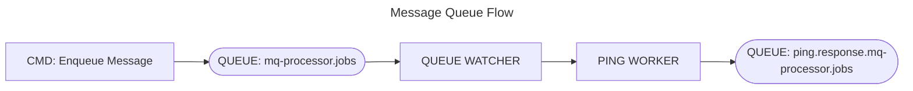

# Queue Worker Pattern

Add a queue watcher to your application

``` csharp
builder.services.AddQueueWatcher(
    config =>
    {
        config.MessageQueueApiUrl = "https://localhost:5001";// url to the messagequeue service;
        config.QueueNameFilter = "mq-processor.jobs";        // filter: this queues will be watched
                                                             // single queue: "my-queue",  
                                                             // queue filter: "my-queues.*" or 
                                                             // serveral queue filters: "my-queues.*,our-queues.*"  
    });
```

if a message received, die watcher sends the message to a registered 
worker. Message must contain the ``WorkerId``

``` csharp
public interface IQueueProcessor
{
    string WorkerId { get; }

    bool ConfirmAlways { get; }
}
```

The ``PingWorker`` is an automatically added for testing with ``AddQueueWatcher``

``` csharp
namespace MessageQueueNET.Client.Services;

internal class PingWorker : INonGenericQueueProcessor
{
    public const string WorkerIdentifier = "mq.ping";

    public string WorkerId => WorkerIdentifier;

    public bool ConfirmAlways => true;

    public Task<QueueProcessorResult> Process(
        BaseQueueProcessorMessage jobProcessMessage, 
        CancellationToken cancellationToken)
    {
        if (jobProcessMessage?.ResultQueue is not null 
            && jobProcessMessage.ResultQueue.StartsWith("ping.response.") == false)
        {
            jobProcessMessage.ResultQueue = $"ping.response.{jobProcessMessage.ResultQueue}";
        }

        return Task.FromResult(new QueueProcessorResult());
    }
}
```

To test you can use the ``MessageQueueNET.Cmd.exe`` console application:

```
.\MessageQueueNET.Cmd.exe https://localhost:5001 -c shell

>> mq-processor.jobs enqueue -ping -m 1
```



## Custom Workers

```csharp
namespace MessageQueueNET.Core.Services.Abstraction;

public interface IGenericQueueProcessor<T> : IQueueProcessor
    where T : new()
{
    Task<QueueProcessorResult> ProcessGeneric(
            GenericQueueProcessorMessage<T> message, 
            CancellationToken cancellationToken
        );
}
```

T => an individual (Body) model that will be received to the Worker, eg:

```csharp
public class CommandLineWorkerMessage
{
    public string Command { get; set; } = "";
    public string Arguments { get; set; } = "";
}

public class CommandLineWorkerResultBody
{
    public int ExitCode { get; set; }
    public string? Output { get; set; }
    public string? ErrorOutput { get; set; }
}
```

```csharp
public class CommandLineWorker : IGenericQueueProcessor<CommandLineWorkerMessage>
{
    public const string WorkerIdentifier = "mq.commandline";

    public CommandLineWorker()
    {
        // Dependencies
    }

    public string WorkerId => WorkerIdentifier;

    public bool ConfirmAlways => true;

    async public Task<QueueProcessorResult> ProcessGeneric(
            GenericQueueProcessorMessage<CommandLineWorkerMessage> 
            message, CancellationToken cancellationToken
        )
    {
        ProcessContext? proccessContext = null;

        try
        {
            // Business logic

            // Return a messages for next worker in the queue => eg. log results (CommandLineResultFileOutputWorker)
            // Message will be written to queue CommandLineResultFileOutputWorker.WorkerIdentifier
            return new GenericQueueProcessorResult<CommandLineWorkerResultBody>()
            {
                Worker = "mq-commandline.result.file",
                Body = new CommandLineWorkerResultBody()
                {
                    Output = ...
                    ErrorOutput = ...,
                    ExitCode = ...
                }
            };
        }
        catch (Exception ex)
        {
            return new QueueProcessorResult()
            {
                Succeeded = false,
                ErrorMessages = ex.ToString()
            };
        }
    }
}

```

Add custom Worker to Dependency Injection:

```csharp
builder.services..AddTransient<IQueueProcessor, CommandLineWorker>();
```

# Sending a Worker Message

Use the Client:

```csharp
var message = new BaseQueueProcessorMessage()
{
    ProcessId = "any id",
    Worker = "mq.ping",  // the WorkerId
    ResultQueue = $"ping.response.{cmdArguments.QueueName}",  // optional => response is written to this queue, for the next worker
    Subject = "ping", // optional
    Publisher = Environment.UserName,  // optional
};

if (!(await client.EnqueueAsync(new string[]
    {
        JsonSerializer.Serialize(message)
    })).Success)
{
    throw new Exception($"Can't enqueue messages...");
}
```

With an custom message body:

```csharp
var message = new GenericQueueProcessorMessage<CommandLineWorkerMessage>()
{
    ProcessId = ... // any id,
    Worker = CommandLineWorker.WorkerIdentifier,
    ResultQueue = $"{cmdArguments.QueueName}.results",
    Subject = ... // optional, eg the command name,
    Publisher = Environment.UserName,
    Body = new()
    {
        Command = cmdArguments.WorkerCommand,
        Arguments = "...." // arguments for the command
    }
};

if (!(await client.EnqueueAsync(new string[]
    {
        JsonSerializer.Serialize(message)
    })).Success)
{
    throw new Exception($"Can't enqueue messages...");
}
```
